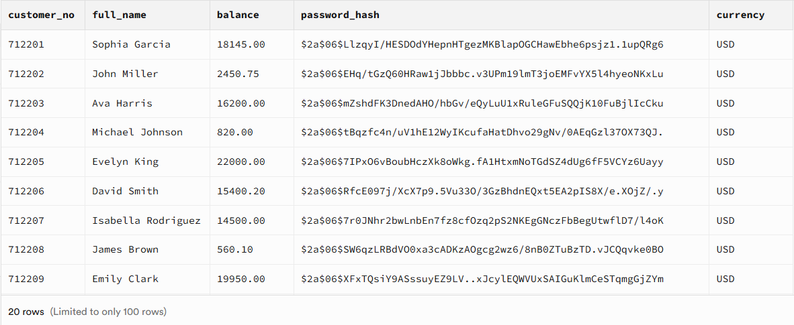
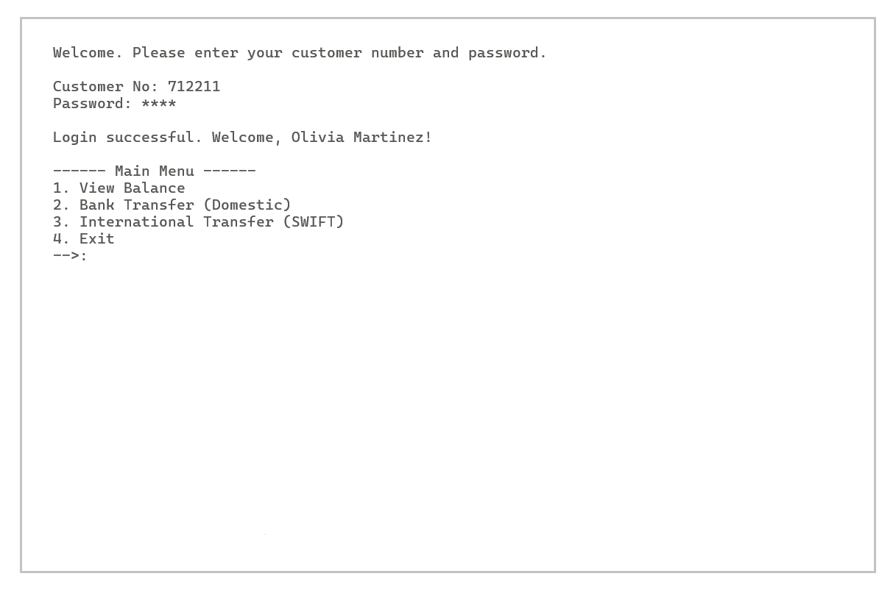

# Bank Transfer Console App

A secure, console-based banking system built with **C# (.NET)** and **PostgreSQL (Supabase)**.

This project is a lightweight fintech simulation designed as a **clean architecture demo** to demonstrate real-world backend engineering principles such as authentication, transactional consistency, and layered system design.

Although it is a console application, the architecture is intentionally designed to be **scalable, maintainable, and production-oriented**.

---

## 🚀 Features

- 🔐 Secure authentication using BCrypt password hashing
- 💰 Account balance viewing
- 💸 Domestic bank transfers between customers
- ⚡ ACID-compliant transactional operations (PostgreSQL transactions)
- 🧱 Clean layered architecture (Separation of Concerns)
- 🧩 Repository + Service pattern implementation
- ⌨ Console-based interactive UI
- 🛡 Input validation + retry mechanisms for better UX

---

## 🏗 Architecture (Clean & Scalable Design)

This project follows a layered architecture pattern inspired by enterprise backend systems:

```text
BankTransferConsoleApp/
│
├── Models/ → Domain entities (Customer)
├── Data/ → Repository layer (Database access abstraction)
├── Services/ → Business logic layer (Auth, Transfer)
├── App.cs → Application orchestration layer
├── Program.cs → Entry point
```

### Key Principles Applied
- Separation of Concerns (SoC): Easy to swap the Console UI with a Web API without touching the business logic.
- Dependency Injection: Handled via a manual, lightweight form to keep dependencies explicit.
- Repository & Service Layer Pattern: Isolates data persistence from core banking rules.
- Single Responsibility Principle (SRP): Each class has only one reason to change.

---

## 🔐 Security & Data Integrity

- Password Safety: Zero plaintext storage. All passwords utilize BCrypt hashing.
- SQL Injection Protection: Fully parameterized queries via Npgsql.
- Authentication logic separated from data access layer

---

## 🧾 Database Structure

The complete PostgreSQL schema, including customer profiles, tables, and constraints, can be found in the [database/init.sql](database/init.sql) file.

```sql
CREATE TABLE public.customers (
    customer_no TEXT PRIMARY KEY,
    full_name TEXT NOT NULL,
    balance NUMERIC NOT NULL,
    password_hash TEXT NOT NULL,
    currency TEXT DEFAULT 'USD'
);

---
## 💳 ACID-Compliant Transaction Logic

- To guarantee data integrity during financial transfers, operations are bound to database-level transactions:
- Validation: Sender's balance is verified before any debit occurs.
- Atomicity: Debit and credit operations execute as a single atomic unit.
- Rollback: Any unexpected failure triggers an automatic rollback, preventing partial state changes or data corruption under concurrent operations.

---
## 🧪 Sample Users

You can use the following pre-seeded mock accounts to test the application's authentication and transfer features:

| Customer No | Full Name       | Balance  | Password Hash                                                | Currency |
| ----------- | --------------- | -------- | ------------------------------------------------------------ | -------- |
| 712201      | Sophia Garcia   | 18500.00 | $2a$11$e09619s5vN5A... (BCrypt)                              | USD      |
| 712202      | John Miller     | 2450.75  | $2a$11$mR3918vX9z2B... (BCrypt)                              | USD      |
| 712203      | Ava Harris      | 16200.00 | $2a$11$pQ2011wL2w9P... (BCrypt)                              | USD      |
| 712204      | Michael Johnson | 820.00   | $2a$11$kL8812zM3x1A... (BCrypt)                              | USD      |

*Note: For actual database records and a visual breakdown, see the preview image below:*



---
## 🛠 Tech Stack

- C# (.NET Console Application)
- PostgreSQL (Supabase)
- Npgsql (PostgreSQL driver)
- BCrypt.Net (Password hashing)

---

## ▶ How to Run
Clone the repository and run the application using the .NET CLI:
git clone [https://github.com/gamzebalkan/bank-transfer-console-app.git](https://github.com/gamzebalkan/bank-transfer-console-app.git)
cd bank-transfer-console-app
dotnet restore
dotnet run --project BankTransferConsoleApp

### 📸 Application Preview

---


## 📄 License

This project is licensed under the MIT License. You are free to use, modify, and distribute this project for personal or commercial purposes with attribution.

